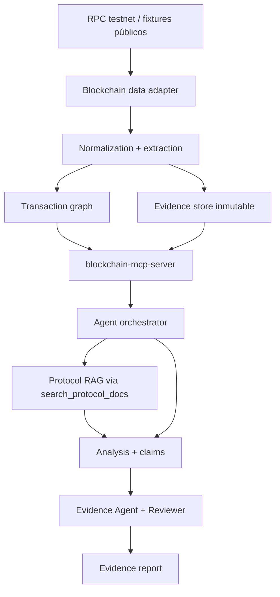

# Diseño de la fundación

## 1. Alcance

Entrada: `chain_id` y hash de transacción, o identificador de fixture. Salida: reporte con resumen, secuencia, contratos, eventos, transferencias reportadas, estado de ejecución, anomalías tipadas, evidencia, contradicciones y limitaciones. Cada investigación comprende una transacción; no explora recursivamente wallets.

Modo inicial y CI: fixtures offline sintéticos o capturas públicas versionadas. M1 habilitará un adapter Ethereum para una testnet configurada y verificada mediante `eth_chainId`; la red concreta se fijará en su change según disponibilidad vigente. Datos de mainnet sólo como snapshots públicos importados; RPC de mainnet queda fuera del alcance inicial. Nunca se necesita wallet, faucet, saldo ni clave privada.

MVP funcional M0–M7: reporte textual/JSON revisado. M8 agrega grafo visual, M9 consolida evaluaciones que empiezan en M0, M10 observabilidad operativa y M11 demo pública con fixtures curados y cuotas.

## 2. Datos soportados

| Datos | Origen | Cobertura y límites |
|---|---|---|
| Transacción | RPC/fixture | hash, from, to nullable, nonce, value, input, tipo, gas y fee fields disponibles; conservar campos desconocidos |
| Receipt | RPC/fixture | status, gasUsed, effectiveGasPrice, contractAddress, logs; null no equivale a fallo |
| Bloque | RPC/fixture | hash, parentHash, number, timestamp, finality consultada; no descargar todas las transacciones |
| Balance | RPC/fixture | activo nativo en bloque explícito; no historial ni balance de tokens |
| Contrato | bytecode y ABI/documentos importados | presencia de código, code hash, procedencia ABI; nombre o protocolo no se deducen por dirección |
| Eventos | logs de receipt/rango acotado | raw siempre; decodificación sólo con ABI o layout estándar justificable |
| Tokens | eventos compatibles ERC-20/721/1155 | unidades enteras, ids y multiplicidad; no equivalen a balance real comprobado |
| Trazas | fixture o proveedor compatible | call tree opcional, flags de revert y error; no portabilidad universal |
| Actividad wallet | sólo relaciones del caso/rango solicitado | sin API de historial completo; declarar ventana y paginación |
| Docs y auditorías | corpus aprobado | contexto técnico, nunca prueba de lo ocurrido on-chain |

El adapter publica capacidades: receipts, logs, historical_state, safe_finalized, trace y ABI enrichment. Lo no disponible produce un estado explícito, nunca un valor inventado. Una cadena EVM adicional requiere perfil de fees, finality, tipos de transacción y fixtures propios; L2, bridges y atribución cross-chain se difieren.

## 3. Modelo de dominio

Todos los objetos llevan `schema_version`; cantidades on-chain usan strings decimales sin float, hashes/datos hex normalizados y direcciones de 20 bytes. `chain_id` es string decimal. Identidad de dirección: `(chain_id,address)`; identidad de snapshot: `(chain_id,block_hash)`.

| Entidad | Identidad y relaciones |
|---|---|
| Investigation | id, input, mode, policy/config versions, run ids, budget, status |
| ChainProfile | chain_id, adapter/version, capacidades, política finality, endpoints administrados |
| Transaction | chain_id + tx_hash; snapshot opcional, receipt y raw evidence refs |
| Receipt / Log | tx_hash + block_hash; log añade log_index; datos raw e interpretación separadas |
| ContractArtifact | chain_id + address + block_hash + code_hash; ABI hash/source, proxy e implementación separadas |
| Transfer | tx + block + log_index + batch_index, asset/address, from/to, raw amount o token_id; evidencia y semántica `event_reported` |
| CallFrame | tx + block + trace_path; caller, context_address, code_address, value, success y ancestor_reverted |
| Evidence / Claim | ids inmutables; referencias y derivaciones según evidence-model.md |
| Anomaly | claim_id, clasificación, detector/version, alcance, umbral y limitaciones |
| Document / Chunk / Citation | content hash, versión, ubicación estable y compatibilidad chain/protocol |
| GraphNode / GraphEdge | identidad tipada, evidence_ids, orden parcial, executed/reverted/unknown |
| Report | investigation/run/revision, claims revisados, cobertura y manifest de reproducción |

Estados de ejecución: pending, success, reverted, unknown; separados de obtención (complete, partial, unavailable) y revisión (accepted, needs_revision, inconclusive). `to=null` es creación; ausencia de código en un bloque no prueba que una dirección nunca fuera contrato. La fee de ejecución se deriva de gasUsed × effectiveGasPrice cuando ambos existen; fees adicionales se separan y el total se declara desconocido si faltan componentes.

## 4. Arquitectura

El flujo representa dependencias, no fuerza cargar toda la cadena antes de consultar una tool. MCP llama servicios de datos compartidos bajo demanda; la normalización y el grafo son determinísticos. El orquestador mantiene una máquina de estados acotada, no un chat libre entre agentes.

Stack propuesto para futuros changes: TypeScript con tipos estrictos para adapters/MCP/orquestación; almacenamiento local de JSON content-addressed y SQLite para M0–M7; búsqueda léxica más embeddings locales versionados para RAG; React para M8. PostgreSQL/pgvector y servicios distribuidos sólo si un change posterior justifica la escala. Fijar versiones de SDK, runtime, modelo y embeddings al implementar, sin depender de `latest`.

RPC, ABI, logs y corpus son entradas no confiables. El servicio verifica chain id y relaciona tx, receipt y bloque por hashes. Resuelve tags una vez y fija el snapshot; consultas de estado deben usar block hash si el proveedor lo admite, o verificar number→hash antes/después. Si no puede garantizar consistencia, devuelve partial/inconsistent, no un reporte final aceptado. Reorg invalida caché por snapshot y genera nueva revisión; no sobrescribe evidencia histórica. Finalized es un estado reportado por proveedor/política, no una verificación criptográfica propia.

## 5. Decisiones y límites

- Baseline determinístico antes del LLM; éste explica evidencia y propone inferencias.
- Sin tracer arbitrario, navegación libre, shell ni ejecución de contratos por agentes.
- Proxy/ABI: asociar al bloque del caso; si falta prueba histórica, preservar identidad desconocida y no decodificar con ABI actual como certeza.
- Un receipt fallido acredita fallo; su causa puede quedar desconocida. `eth_call` posterior no reproduce necesariamente el estado original y no se usa como prueba causal.
- Logs tienen orden, pero sin trazas no se inventa una jerarquía causal de llamadas. Un evento Transfer compatible puede ser emitido por código no conforme.
- No se usan trazas de llamadas revertidas como transferencias efectivas; una subllamada fallida capturada no implica fallo de la transacción completa.

## Referencias técnicas consultadas (2026-09-23)

- [Ethereum JSON-RPC](https://ethereum.org/developers/docs/apis/json-rpc/): campos de transacción/receipt y referencias a bloques.
- [ERC-20](https://eips.ethereum.org/EIPS/eip-20), [ERC-721](https://eips.ethereum.org/EIPS/eip-721), [ERC-1155](https://eips.ethereum.org/EIPS/eip-1155): semántica y layouts de eventos.
- [Geth tracing](https://geth.ethereum.org/docs/developers/evm-tracing) y [debug namespace](https://geth.ethereum.org/docs/interacting-with-geth/rpc/ns-debug): capacidades de trazas específicas del cliente.
- [MCP tools](https://modelcontextprotocol.io/specification/2026-07-28/server/tools) y [límites de annotations](https://blog.modelcontextprotocol.io/posts/2026-03-16-tool-annotations/): contrato de tools; los hints no sustituyen permisos.
- [OpenSpec overview](https://github.com/Fission-AI/OpenSpec/blob/main/docs/overview.md): organización de artifacts del change.

Estas fuentes fundamentan el diseño; todavía no constituyen un corpus RAG descargado ni versionado.
